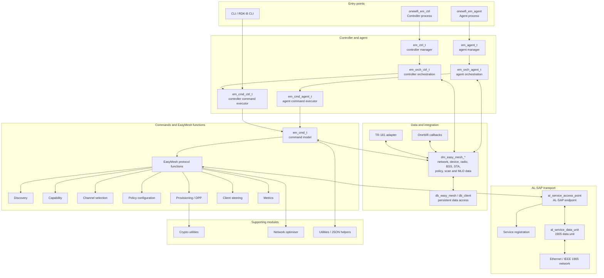
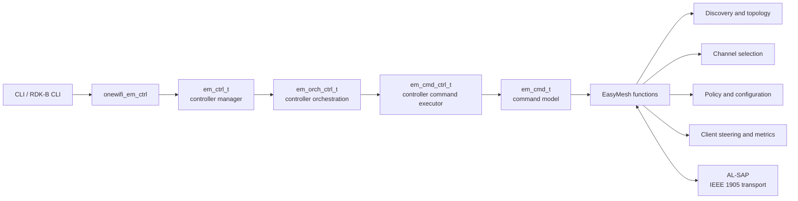
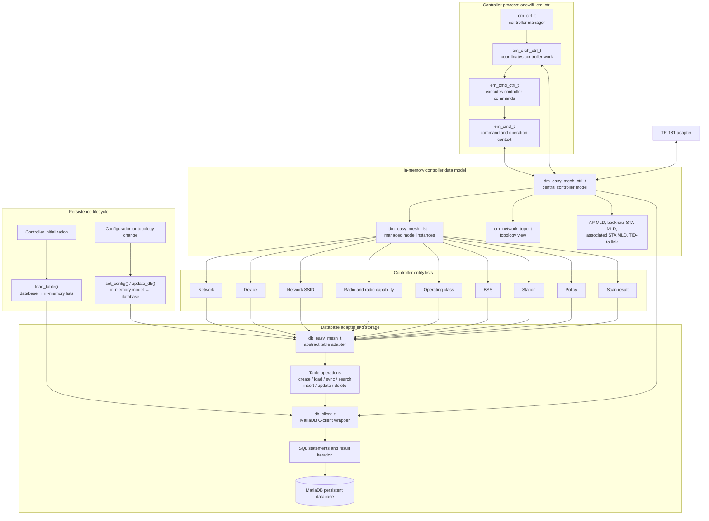
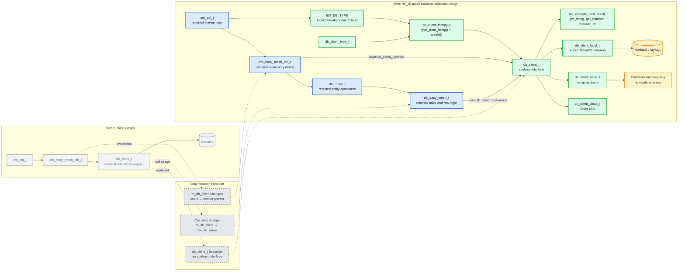

# Unified Wi-Fi Mesh architecture

This editable component diagram covers the `unified-wifi-mesh` subproject.
It uses [Mermaid](https://mermaid.js.org/), so GitHub and many Markdown
editors can render it directly. Edit the labels and connections in the fenced
`mermaid` block to keep it current.

## Source map

| Diagram area | Source locations |
| --- | --- |
| Controller and agent entry points | `src/ctrl/`, `src/agent/` |
| Commands and orchestration | `src/cmd/`, `src/orch/`, `inc/em_cmd*.h`, `inc/em_orch*.h` |
| EasyMesh protocol functions | `src/em/{disc,capability,channel,policy_cfg,prov,steering,metrics}/` |
| Data model and persistence | `src/dm/`, `src/db/`, `inc/dm_*.h`, `inc/db_*.h` |
| TR-181 and OneWifi integration | `src/ctrl/tr_181/`, `inc/tr_181.h`, `inc/em_onewifi.h` |
| AL-SAP / IEEE 1905 transport | `src/al-sap/`, `inc/al_service_*.h` |
| CLI and utilities | `src/cli/`, `src/rdkb-cli/`, `src/utils/`, `src/util_crypto/` |

## Controller-only view

This view isolates the controller process and the work it coordinates. It is
useful when tracing a CLI or management request through controller logic to an
IEEE 1905 message.

Relevant sources: `src/ctrl/`, `src/orch/`, `src/cmd/`, and
`src/em/`.

## Controller and database view

This view shows the controller's in-memory data model, its per-entity database
adapters, and its MariaDB-backed persistence path. The model owns a
`db_client_t` instance; each list type also implements `db_easy_mesh_t`, which
maps an EasyMesh entity to a database table and its columns. OneWifi callbacks
are agent-side and are intentionally omitted here.

The persisted controller lists are network, device, network SSID, radio,
operating class, BSS, station, policy, and scan result. MLO entities are part
of the in-memory controller model but are not shown as a database-list mapping
in this diagram.

Relevant sources: `src/ctrl/dm_easy_mesh_ctrl.cpp`, `src/dm/`, `src/db/`,
`inc/dm_easy_mesh_ctrl.h`, `inc/db_easy_mesh.h`, and `inc/db_client.h`.

## NO-DB: `no_db.patch` backend-selection design

This diagram represents the proposed changes in `no_db.patch`; it does not
claim that the patch has already been applied. The patch preserves the
controller's in-memory data model and table logic, but replaces its fixed
MariaDB client with a selectable persistence backend.

**Color key:** muted gray = base design being replaced; dashed gray =
transition/refactor point; blue = retained controller or table logic; green =
new entity introduced by the patch; amber = runtime storage target.

This single diagram keeps the overall backend-selection representation while
showing the transition from the base design.

With `EM_DB_TYPE=none`, the factory returns `db_client_none_t`. Database calls
remain valid calls through `db_client_t`, but the backend returns no rows and
performs no writes. The existing `dm_*_list_t` containers therefore remain the
authoritative runtime state. `local` remains the default and retains the
MariaDB-backed behavior; `cloud` is wired through the factory but deliberately
fails until implemented.

Patch-specific files: `no_db.patch`, `inc/db_client*.h`,
`src/db/db_client_{local,none,cloud,factory}.cpp`,
`inc/dm_easy_mesh_ctrl.h`, and `src/ctrl/{dm_easy_mesh_ctrl,em_ctrl}.cpp`.
