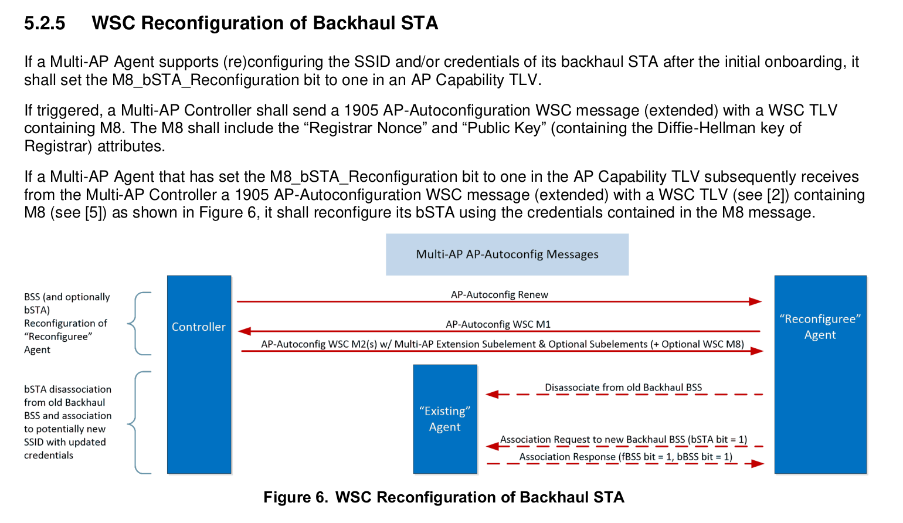
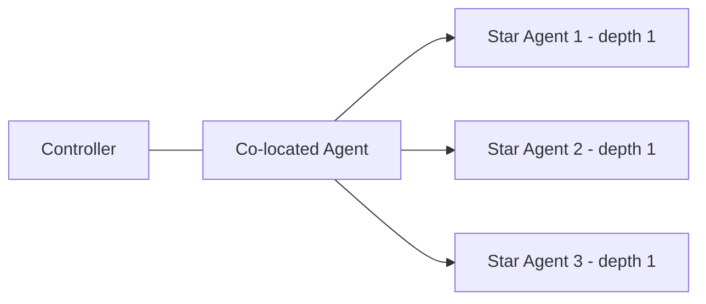
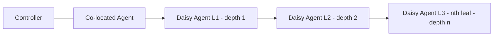
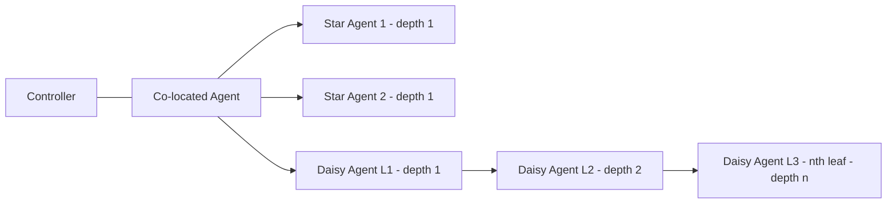
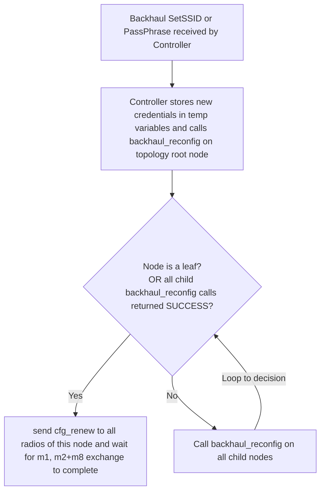
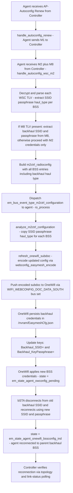
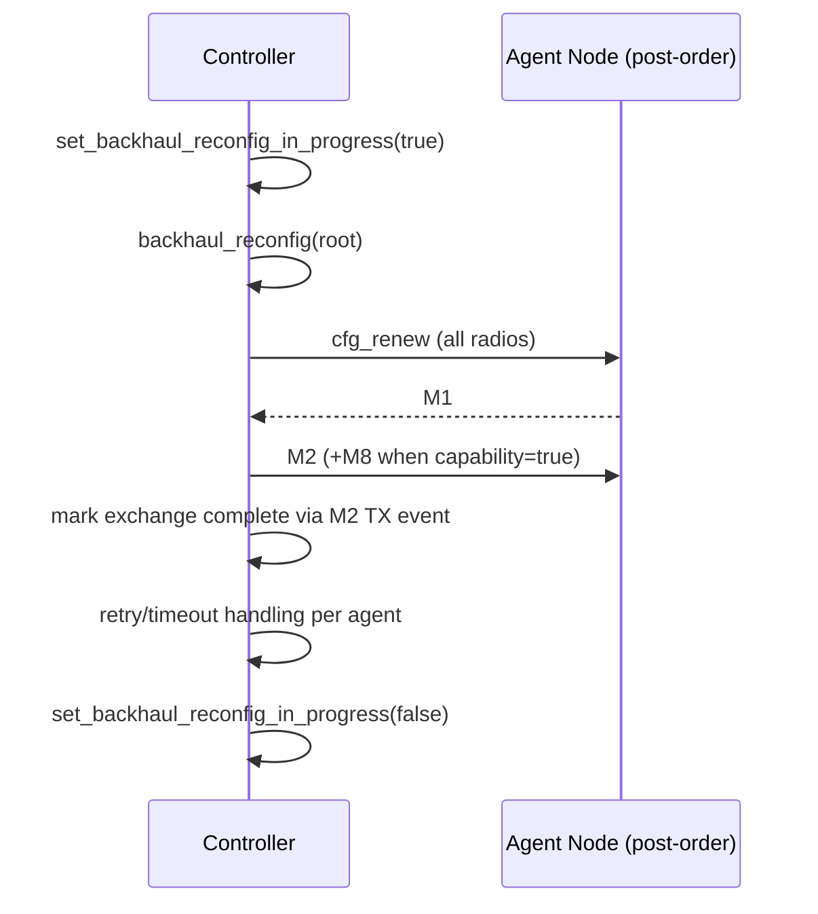
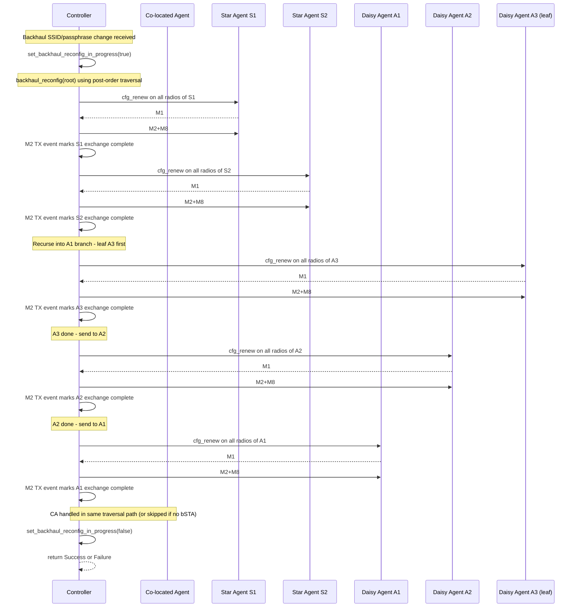
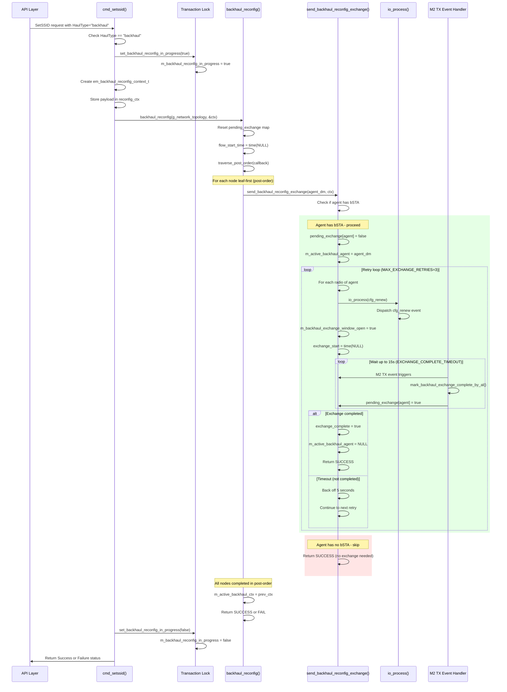

# Backhaul SSID Reconfiguration Flow

This document describes the current controller and agent flow for backhaul SSID/passphrase reconfiguration.

## Current Behavior

1. Backhaul SetSSID request enters `em_ctrl_t::cmd_setssid()`.
2. Controller enables a transaction lock (`m_backhaul_reconfig_in_progress`) to block onboarding of unknown agents during the run.
3. Controller runs recursive post-order orchestration through `em_ctrl_t::backhaul_reconfig(...)`.
4. Each visited agent uses the same exchange path via `send_backhaul_reconfig_exchange(...)`.
5. For each target agent, controller dispatches `cfg_renew` on all radios, waits for M1->M2 completion signal, and retries up to `MAX_EXCHANGE_RETRIES`.
6. Co-located agent is processed in the same recursive traversal (post-order), not by a separate final apply stage.
7. Flow success/failure is based on bounded exchange completion only. There is no runtime post-exchange verification poll stage.
8. Transaction lock is released before returning success/failure.

## Constants In Use

1. `MAX_EXCHANGE_RETRIES = 3`
2. `MAX_COLOCATED_APPLY_RETRIES = 3` (kept for compatibility helper API)
3. `EXCHANGE_COMPLETE_TIMEOUT = 15s`
4. `M1_TIMEOUT = 5s` (reserved)

## Capability Handling

1. AP Capability TLV advertises `m8_bsta_reconfiguration = 1`.
2. Capability report parsing stores this into `radio_info.support_m8_bsta_reconfiguration`.
3. M2 construction appends M8 for backhaul only when the stored capability is true.

## Onboarding Guard

1. While `m_backhaul_reconfig_in_progress` is true, unknown AL-MAC onboarding via autoconfig search is rejected.
2. Existing known agents in the topology continue in the reconfiguration flow.

## Topology Shapes (Reference Only)

The topology diagrams below are shape references only. A single unified recursive post-order flow is used for all of them.

**Pure Star** — all agents are directly connected to the controller (depth=1 each):

**Daisy Chain** — agents form a linear chain with increasing depth:

**Mixed** — combination of star and daisy-chain agents:

## Recursive Post-Order Flow

## Agent Reconfiguration Flow

Agent Reconfiguration Flow
## Sequence Summary

## Unified Example and Sequence

Combined topology example: `C -> {S1, S2, A1}` and `A1 -> A2 -> A3`.

Recursive post-order execution trace (actual code behavior):

- `cmd_setssid(backhaul)` sets `m_backhaul_reconfig_in_progress=true` and invokes `backhaul_reconfig(g_network_topology, &ctx)`.
- `backhaul_reconfig(...)` uses post-order traversal and calls `send_backhaul_reconfig_exchange(...)` for each visited node.
- For `S1` and `S2` (leaves), controller sends `cfg_renew` on all radios, waits for exchange completion, and retries (bounded) if needed.
- For branch `A1 -> A2 -> A3`, post-order visits `A3`, then `A2`, then `A1`, each through the same exchange function.
- Exchange completion is marked by M2 TX event handling (`handle_m2_tx -> mark_backhaul_exchange_complete_by_al`) for the active agent window.
- Co-located/controller node is not handled by a separate final apply stage; it is part of the same traversal path.
- If a node has no bSTA, `send_backhaul_reconfig_exchange(...)` returns success for that node without running exchange.
- On first exchange failure after retries, traversal fails fast and `cmd_setssid` returns failure.
- On overall success, `cmd_setssid` returns success and clears the transaction lock.
- There is no runtime post-exchange verification polling gate in this path.

## Need To Work

1. What if one agent updated to the new credential and another agent did not?
    Current behavior: flow is fail-fast in a unified exchange path, but partial remote updates can still occur before a later agent fails. Those partially updated agents may disconnect and require recovery/re-onboarding.
    Need to work: add explicit partial-update handling with a recovery policy (automatic rollback where possible, otherwise targeted re-onboard workflow) and publish an alarm containing the impacted agent list.

2. What if a new agent is onboarded during reconfiguration?
    Current behavior: onboarding during an active reconfiguration window is not transaction-isolated, so timing can cause old/new credential race conditions.
    Need to work: introduce a reconfiguration epoch/lock, queue or gate onboarding until exchange orchestration completes, then run a reconciliation pass to force consistent backhaul credentials on newly onboarded agents.

## Notes

1. Documentation and code intentionally do not include a runtime post-exchange polling gate anymore.
2. Operational convergence is expected from normal topology/data-model updates after successful exchanges.

## Detailed Code Flow (Actual Implementation)

**Code Flow Reference Points:**

| Function | File | Purpose |
|----------|------|---------|
| `cmd_setssid()` | `dm_easy_mesh_ctrl.cpp:64` | Entry point, checks HaulType, sets transaction lock |
| `backhaul_reconfig()` | `em_ctrl.cpp:1284` | Recursive post-order traversal orchestrator |
| `send_backhaul_reconfig_exchange()` | `em_ctrl.cpp:1342` | Per-agent cfg_renew → M1 → M2+M8 exchange with retries |
| `mark_backhaul_exchange_complete_by_al()` | `em_ctrl.cpp:246` | M2 TX event callback, marks exchange complete |
| `io_process(em_bus_event_type_cfg_renew, ...)` | Event dispatch | Sends cfg_renew to agent |