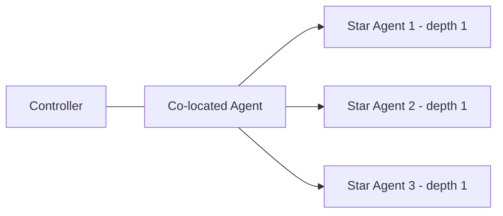
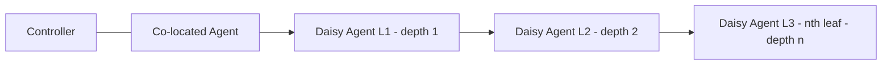
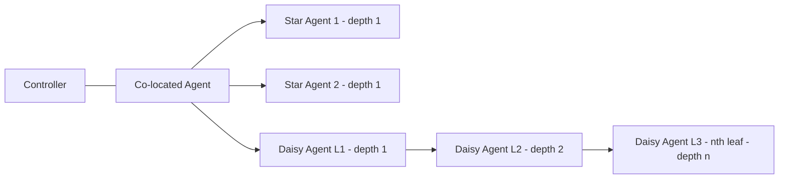
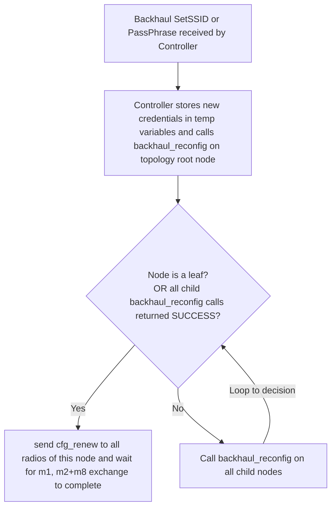
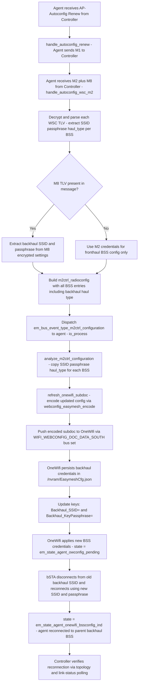
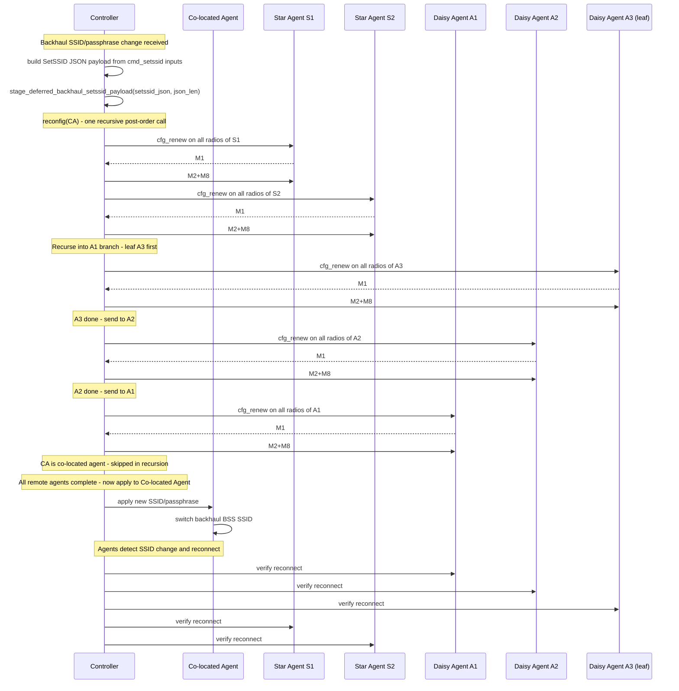

# Backhaul SSID Reconfiguration Flow (EasyMesh v6.0, Section 5.2.5)

This document defines the updated backhaul SSID/passphrase reconfiguration flow using a single recursive function. The function traverses topology in post-order (children before parent). For each non-co-located node, controller dispatches AP-Autoconfig Renew (`cfg_renew`) on all radios of that agent, then completes `M1 -> M2+M8` through the same recursive code path. The co-located agent is updated last only when all remote-node processing succeeds.


## Executive Summary.

1. Goal: rotate backhaul credentials across the full mesh without leaving the network in a split state.
2. Control strategy: recursive post-order execution (children first, parent later) with bounded retries.
3. Reliability guardrails: per-agent retry cap (`MAX_EXCHANGE_RETRIES`) and bounded global verification (`VERIFY_MAX_DURATION`).
4. Safety gate: co-located/root apply is deferred until all remote exchanges complete successfully.
5. Current implementation note: child recursion is sequential (deterministic fail-fast); parallel sibling processing can be added later if needed.

## Key Update

1. Precomputed depth sorting is removed; recursion order itself guarantees children-before-parent processing.
2. Pending maps are reset at recursion root and populated dynamically per remote agent during exchange.
3. Controller currently assumes connected agents support backhaul reconfiguration capability.
4. One recursive function handles all non-co-located nodes (leaf and parent) through the same code path.
5. `cfg_renew` is dispatched on all radios of each target non-co-located agent.
6. Per-agent exchange retries are bounded by `MAX_EXCHANGE_RETRIES`; exhausted nodes return `FAIL`.
7. Co-located apply is gated and executed only after remote recursion returns `SUCCESS`.
8. Verification is time-bounded (`VERIFY_MAX_DURATION`) with 1-second polling.
9. Verification uses pending exchange maps; no separate `unverified_set` object is required in implementation.
10. Exchange completion wait is bounded by `EXCHANGE_COMPLETE_TIMEOUT`; M1 handling is event-driven in the current code path.

## Required Conditions

1. Backhaul SSID/passphrase change must reach every connected agent in star, daisy-chain, or mixed topologies.
2. The same recursive function sends `cfg_renew -> M1 -> M2+M8` to every non-co-located node, leaf and parent, without separate code paths.
3. A parent node receives AP-Autoconfig Renew only after all of its children have completed the exchange successfully (post-order guarantee).
4. Controller sends `cfg_renew`, receives `M1`, and sends `M2+M8` for each non-co-located agent, with `cfg_renew` dispatched across all radios of that agent.
5. Per-node exchange uses bounded retries (`MAX_EXCHANGE_RETRIES`) and returns `FAIL` when exhausted.
6. A child `FAIL` propagates to its parent and up to root so the flow exits with failure instead of hanging.
7. The co-located agent backhaul SSID apply is deferred until all recursive calls complete with `SUCCESS`.
8. Verification remains active with bounded limit (`VERIFY_MAX_DURATION`) and 1-second polling.
9. Verification reuses pending exchange maps created during recursion and exchange.
10. Current implementation processes sibling recursion sequentially; first child `FAIL` propagates immediately.
11. Verification retry is a topology/link-status poll for unresolved nodes; it does not resend exchange.
12. On failure exit, controller raises management fault, logs failed agents, keeps active credentials unchanged, and marks failed nodes for re-onboarding.

## Recommended Constants

1. `MAX_EXCHANGE_RETRIES = 3`
2. `MAX_COLOCATED_APPLY_RETRIES = 3`
3. `VERIFY_MAX_DURATION = 60s`
4. `M1_TIMEOUT = 5s` (reserved for explicit M1 timeout instrumentation)
5. `EXCHANGE_COMPLETE_TIMEOUT = 15s`

## EasyMesh v6.0 Alignment

1. If an agent supports reconfiguration of backhaul SSID and/or credentials after initial onboarding, it sets `M8_bSTA_Reconfiguration` to `1` in AP Capability TLV (v6.0 section 5.2.5).
2. When reconfiguration is triggered, the controller sends a 1905 AP-Autoconfiguration WSC message (extended) containing WSC `M8` (v6.0 section 5.2.5).
3. An agent that advertised `M8_bSTA_Reconfiguration=1` and receives WSC `M8` reconfigures its bSTA using credentials in `M8` (v6.0 section 5.2.5).
4. The single recursive post-order traversal in this document is an implementation policy for topology orchestration; it does not replace the normative EasyMesh message requirements above.

## Topology Shapes (Reference Only)

The topology diagrams below are shape references only. A single unified recursive post-order flow is used for all of them.

**Pure Star** — all agents are directly connected to the controller (depth=1 each):



**Daisy Chain** — agents form a linear chain with increasing depth:



**Mixed** — combination of star and daisy-chain agents:




## Recursive Post-Order Flow



## Agent Reconfiguration Flow

## Functional Description

1. Controller receives backhaul SSID/passphrase update via a linked list of properties and extracts required parameters.
2. Controller calls one recursive function on the topology root (post-order traversal).
3. Current implementation executes child recursion sequentially; traversal remains post-order.
4. If any child returns `FAIL`, failure propagates up immediately and recursion exits.
5. For each non-co-located node, controller runs bounded `cfg_renew -> M1 -> M2+M8` exchange.
6. `cfg_renew` is dispatched on all radios belonging to the target agent.
7. Exchange completion is bounded by `EXCHANGE_COMPLETE_TIMEOUT`; retries are capped by `MAX_EXCHANGE_RETRIES`.
8. Co-located agent apply runs only when root recursion result is `SUCCESS`.
9. Co-located apply is retried with bounded attempts; on exhaustion the flow exits with failure.
10. Verification phase polls pending-agent completion every 1 second for up to `VERIFY_MAX_DURATION`.
11. Verification does not resend `cfg_renew` or `M2+M8`.
12. Flow exits with success only when pending count reaches zero within bounded time.
13. On failure exit, raise USP fault event, log failed nodes, keep active credentials unchanged, and require failed nodes to re-onboard before re-trigger.

## Unified Topology Coverage

1. One recursive function handles star, daisy-chain, and mixed topologies with the same code path.
2. Post-order traversal: children are always processed before the parent node.
3. Leaf nodes (no children) are reached first and receive `cfg_renew -> M1 -> M2+M8` immediately.
4. Parent/intermediate nodes receive `cfg_renew -> M1 -> M2+M8` only after all their children complete.
5. Sibling star nodes are independent, but current implementation processes them sequentially.
6. Daisy-chain deepest leaf receives autoconfig renew first; its parent receives it after it returns, and so on upward.
7. Co-located agent apply is always the global last step and only after successful remote completion.
8. No precomputed depth-based sorting is required; pending maps are built dynamically during exchange.
9. Current code uses deterministic fail-fast child handling (first failed child exits recursion).

## Pseudo-Code

```text
MAX_EXCHANGE_RETRIES = 3
MAX_COLOCATED_APPLY_RETRIES = 3
VERIFY_MAX_DURATION = 60s
M1_TIMEOUT = 5s
EXCHANGE_COMPLETE_TIMEOUT = 15s


cmd_setssid(input_param_list):
    // Step 1: Extract parameters from linked list (bus_data_prop_t *input_params)
    new_ssid = NULL
    new_passphrase = NULL
    haul_type = NULL
    add_remove_change = NULL
    
    for each prop in input_param_list:
        if prop->name == "SSID":
            new_ssid = prop->value
        else if prop->name == "PassPhrase":
            new_passphrase = prop->value
        else if prop->name == "HaulType":
            haul_type = prop->value
        else if prop->name == "AddRemoveChange":
            add_remove_change = prop->value
        prop = prop->next_data

    // Step 2: Validate extraction
    if new_ssid == NULL or add_remove_change == NULL:
        return handle_backhaul_reconfig_failure("Missing mandatory parameters (SSID or AddRemoveChange)")

    // Step 3: Verify every connected agent advertises M8_bSTA_Reconfiguration=1
    if not check_agents_support_backhaul_reconfig():
        return handle_backhaul_reconfig_failure("One or more agents do not support backhaul reconfiguration")

    // Step 4: Build SetSSID JSON payload and stage for M2+M8 distribution
    setssid_json = build_setssid_payload_from_cmd_inputs(new_ssid, new_passphrase, haul_type, add_remove_change)
    if setssid_json == NULL:
        return handle_backhaul_reconfig_failure("Failed to build SetSSID payload")

    if not stage_deferred_backhaul_setssid_payload(setssid_json, len(setssid_json)):
        return handle_backhaul_reconfig_failure("Failed to stage deferred SetSSID payload")

    // Step 5: Initiate recursive post-order traversal on topology root
    topo_root = g_network_topology
    if topo_root == NULL:
        return handle_backhaul_reconfig_failure("Topology not initialized")

    root_result = backhaul_reconfig(topo_root)
    if root_result != SUCCESS:
        return handle_backhaul_reconfig_failure("M1/M2+M8 exchange failed on one or more remote agents")

    // Step 6: Co-located agent apply — always the global last step
    if not apply_backhaul_setssid_to_colocated_with_retry():
        return handle_backhaul_reconfig_failure("Co-located agent backhaul apply failed")

    // Step 7: Verification — poll up to VERIFY_MAX_DURATION
    if not verify_backhaul_reconfig_with_bounded_retry():
        return handle_backhaul_reconfig_failure("Verification timeout: one or more agents failed to reconnect")

    return SUCCESS


build_setssid_payload_from_cmd_inputs(new_ssid, new_passphrase, haul_type, add_remove_change):
    // Build the same SetSSID subdoc JSON buffer used by cmd_setssid implementation
    // (SSID list update, add/remove/change operation, haul type filtering, optional band/passphrase fields)
    // Returns encoded SetSSID JSON payload ready for M2+M8 distribution
    return encoded_setssid_json_payload


handle_backhaul_reconfig_failure(reason):
    log(reason)
    log_failed_agents()
    keep_active_credentials_unchanged()  // staged payload is discarded; live config unchanged
    return FAILURE


// Co-located agent apply with bounded retries
apply_backhaul_setssid_to_colocated_with_retry():
    for attempt = 1 to MAX_COLOCATED_APPLY_RETRIES:
        if apply_deferred_backhaul_setssid():
            return true
        if attempt < MAX_COLOCATED_APPLY_RETRIES:
            sleep(1s)
    return false


// Verification loop: poll every 1s up to VERIFY_MAX_DURATION
verify_backhaul_reconfig_with_bounded_retry():
    start_time = now
    while (now - start_time) < VERIFY_MAX_DURATION:
        clear_verified_pending_bsta_reconfig()    // remove agents that reconnected
        if get_pending_bsta_reconfig_count() == 0:
            return true
        sleep(1s)
    return get_pending_bsta_reconfig_count() == 0


// Single recursive function: post-order (children before self)
// Decision: Is node a leaf OR did all children return SUCCESS?
// YES: send cfg_renew -> M1 -> M2+M8 to this node on all radios
// NO: recurse into children, fail-fast on first child FAIL
backhaul_reconfig(topo_node):
    node_dm = topo_node.get_data_model()

    // At root (controller node): reset pending exchange state for this flow
    if node_dm.is_controller():
        clear pending_bsta_reconfig map
        clear pending_bsta_reconfig_exchange_complete map

    // Decision Point: Are there child nodes?
    has_children = (topo_node.children != NULL and topo_node.children.count > 0)
    
    if has_children:
        // Recurse into all child nodes first (post-order guarantee)
        for each child in topo_node.children:
            child_result = backhaul_reconfig(child)
            if child_result == FAIL:
                return FAIL                       // fail-fast: first child FAIL propagates immediately
        // All children succeeded, proceed to exchange for this node

    // Skip co-located/controller node — applied after all recursion succeeds
    if node_dm.is_controller():
        return SUCCESS

    // Send cfg_renew -> M1 -> M2+M8 exchange to this remote node on ALL radios
    return send_backhaul_reconfig_exchange(node_dm)


// Per-node exchange with bounded retries
send_backhaul_reconfig_exchange(agent_dm):
    if agent_dm == NULL or agent_dm.is_controller():
        return SUCCESS
    if agent_dm.get_bsta_bss_info() == NULL:
        return SUCCESS                             // no bSTA — nothing to reconfig

    radios = find_all_non_al_radios_for_agent(agent_dm)
    if radios is empty:
        return FAIL

    register agent in pending_bsta_reconfig map
    set pending_bsta_reconfig_exchange_complete[agent] = false

    for attempt = 1 to MAX_EXCHANGE_RETRIES:
        reset pending_bsta_reconfig_exchange_complete[agent] = false
        for each radio in radios:
            send_cfg_renew(radio)                 // AP-Autoconfig Renew on every agent radio

        // Wait up to EXCHANGE_COMPLETE_TIMEOUT seconds for M2+M8 exchange to complete
        for wait_sec = 0 to EXCHANGE_COMPLETE_TIMEOUT:
            if pending_bsta_reconfig_exchange_complete[agent] == true:
                return SUCCESS                    // exchange confirmed complete
            sleep(1s)

        // Exchange timed out; back off before next attempt
        if attempt < MAX_EXCHANGE_RETRIES:
            sleep(5s)

    return FAIL                                   // exhausted all retries
```

## Unified Example and Sequence

Combined topology example: `C -> {S1, S2, A1}` and `A1 -> A2 -> A3`.

Recursive post-order execution trace (success path; failure path shown in flowchart/pseudo-code):

- `reconfig(C)` starts, recurses into children of C: `S1`, `S2`, `A1`.
- Current implementation processes children sequentially (example order shown below: `S1` then `S2` then `A1`).
- `reconfig(S1)` — `S1` is a leaf (no children). Sends `cfg_renew -> M1 -> M2+M8` to `S1` directly.
- `reconfig(S2)` — `S2` is a leaf. Sends `cfg_renew -> M1 -> M2+M8` to `S2` directly.
- `reconfig(A1)` — recurses into children of `A1`: `A2`.
- `reconfig(A2)` — recurses into children of `A2`: `A3`.
- `reconfig(A3)` — `A3` is a leaf. Sends `cfg_renew -> M1 -> M2+M8` to `A3` directly.
- Returns to `A2`: all children done. Sends `cfg_renew -> M1 -> M2+M8` to `A2`.
- Returns to `A1`: all children done. Sends `cfg_renew -> M1 -> M2+M8` to `A1`.
- Returns to `C`: `C` is co-located agent — skipped inside recursion.
- **Final** — all recursive calls complete: controller applies SSID/passphrase to co-located `C`.
- **Verify** — all nodes (`S1`, `S2`, `A3`, `A2`, `A1`) verified reconnected by bounded 1-second polling.



## Completion Criteria

1. Every connected non-co-located agent — leaf and parent — completed `cfg_renew -> M1 -> M2+M8` via the same recursive function.
2. Co-located agent SSID/passphrase apply is executed only after remote recursion returns `SUCCESS`.
3. All agents verified reconnected with new backhaul credentials.
4. Flow exits deterministically with `SUCCESS` or bounded `FAILURE`; no infinite loops/hangs.
5. Verification state is represented by pending exchange maps and reaches zero before timeout.
6. On `FAILURE`, system raises fault event, logs failed agents, keeps active credentials unchanged, and requires failed agents to re-onboard before re-triggering SetSSID.

## Need To Work

1. What if one agent updated to the new credential and another agent did not?
    Current behavior: flow is fail-fast and co-located apply is gated, but partial remote updates can still occur before a later agent fails. Those partially updated agents may disconnect and require recovery/re-onboarding.
    Need to work: add explicit partial-update handling with a recovery policy (automatic rollback where possible, otherwise targeted re-onboard workflow) and publish an alarm containing the impacted agent list.

2. What if a new agent is onboarded during reconfiguration?
    Current behavior: onboarding during an active reconfiguration window is not transaction-isolated, so timing can cause old/new credential race conditions.
    Need to work: introduce a reconfiguration epoch/lock, queue or gate onboarding until exchange+verify completes, then run a post-verify reconciliation pass to force consistent backhaul credentials on newly onboarded agents.
