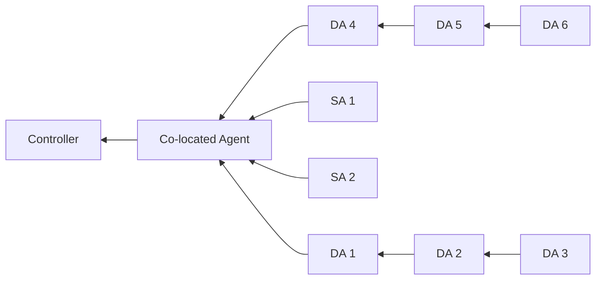

# Backhaul Feature Development Tracker

| # | Task / Module | Description | Status | Priority | Notes |
|---|---------------|-------------|--------|----------|-------|
| 1 | Requirements  | Gather project requirements | ✅ Done | High | Spec 6: EasyMesh Section 5.2.5 |
| 2 | Design        | Prepare architecture/design | ✅ Done | High | orchestrator-driven leaf-first reconfig |
| 3 | Development   | Implement features/modules | 🔄 In Progress | High | Core flow implemented, items #8/#12–15 remain |
| 4 | Testing       | Unit and integration testing | ☐ Pending | High | No items tested yet |
| 5 | Documentation | Write technical docs | 🔄 In Progress | Medium | Design doc + changelog + this checklist created |
| 6 | Release       | Final build and deployment | ☐ Pending | High | Compilation not yet attempted |

## Checklist

- [x] Requirements completed
- [x] Design approved
- [ ] Development completed
- [ ] Testing completed
- [ ] Documentation completed
- [ ] Release completed

# Challenge in development

| # | Challenge                      | Description                                                                                                                     | Impact | Mitigation Strategy                                                                                                    | Status      | Tested     |
|---|--------------------------------|---------------------------------------------------------------------------------------------------------------------------------|--------|------------------------------------------------------------------------------------------------------------------------|-------------|------------|
| 1 | Backhaul change identification | Identifying method call is for backhaul reconfiguration to cmd_setssid and trigger IO process with bh reconfiguration bus event. | Medium | Implement a mechanism to accurately identify backhaul reconfiguration calls and ensure proper triggering of IO processes. | Implemented | Not Tested |
| 2 | Topology layer management       | Managing topology layers and ensuring correct processing of backhaul reconfiguration events across layers.                      | High   | Develop a robust system for tracking topology layers and handling backhaul reconfiguration events accordingly.         | Implemented | Not Tested |  
| 3 | State management during reconfig | Ensuring that the system correctly manages states during backhaul reconfiguration, especially in edge cases.                    | High   | Implement comprehensive state management and testing to handle various scenarios during backhaul reconfiguration.      | Implemented | Not Tested |
| 4 | Leaf node first reconfiguration   | Ensuring that leaf nodes are reconfigured first before branches during backhaul SSID changes.                                      | High   | Implement logic to prioritize leaf node reconfiguration and ensure proper sequencing of events.                      | Implemented | Not Tested |
| 5 | Need to check all the leaves are reconfigured before reconfig the branch | Ensuring that all leaf nodes under a branch are reconfigured before the branch itself is reconfigured. If not reconfigured, then the leaf nodes should again go for reconfiguration before the parent. | High | Implement checks to verify that all leaf nodes have completed reconfiguration before proceeding with branch reconfiguration. | Implemented | Not Tested | 
| 6 | Agent Backhaul reconfiguration capability check | Check the agent capability before trigger the backhaul reconfiguration, if the agent does not support the backhaul reconfiguration, then stop the reconfiguration process. | Medium | Implement capability checks for agents before initiating backhaul reconfiguration to ensure compatibility and prevent issues. | Implemented | Not Tested |
| 7 | Reconfiguration completion detection | Implementing a mechanism to detect when backhaul reconfiguration is complete across all nodes.                                      | High   | Develop a system to track the completion status of backhaul reconfiguration across nodes and trigger subsequent actions accordingly. | Implemented | Not Tested |
| 8 | Reconfiguration event handling   | Ensuring that backhaul reconfiguration events are handled correctly, especially in cases where multiple events may be triggered (Race Condition). | High   | Implement robust event handling logic to manage multiple backhaul reconfiguration events and ensure proper sequencing. `is_cmd_type_in_progress` blocks concurrent events. | Partially Implemented | Not Tested |
| 9 | By default Agents support backhaul reconfiguration in RDKB agent | By default, all agents should support backhaul reconfiguration. Ensure that this is properly implemented and tested in the RDKB agent. | Medium | Implement default support for backhaul reconfiguration in the RDKB agent and conduct thorough testing to confirm functionality. | Implemented | Not Tested |
| 10 | Reconfiguration event retriggering   | Implementing a mechanism to retrigger backhaul reconfiguration events if necessary, especially in cases where the initial reconfiguration may not have been successful. | High   | Approach (B): `send_bh_reconfig_event()` in `submit_command` (empty layer) and `handle_timeout` (fini hook) drives layer-by-layer re-triggering. | Implemented | Not Tested |
| 11 | Ensure to create M8 message | If agent supports bsta_reconfiguration and identified backhaul change, then create M8 message and send to agent with M2. | Medium | Implement logic to create and send M8 messages to agents that support backhaul reconfiguration when a backhaul change is detected. | Implemented | Not Tested |
| 12 | M8 message encryption | Ensure that m8 message containing ssid and password is encrypted from controller side before sending | High | Implement encryption for M8 messages containing sensitive information before sending to agents. | Not implemented | Not Tested |  
| 13 | ensure agents gets connected with new backhaul ssid | After backhaul reconfiguration, ensure that agents are able to connect to the new backhaul SSID successfully using topology tree. | High | Implement testing and validation to confirm that agents can connect to the new backhaul SSID after reconfiguration. | Not implemented | Not Tested |
| 14 | Topology tree update after backhaul reconfiguration | Ensure that the topology tree is updated correctly after backhaul reconfiguration to reflect the new network structure. | Medium | Implement logic to update the topology tree accurately in interval of time | Not implemented | Not Tested |
| 15 | What if any agent doesn't connect with new backhaul SSID after reconfiguration | Implement a mechanism to handle cases where agents fail to connect to the new backhaul SSID after reconfiguration, including potential retries or fallback options. | High | Develop a system to detect failed connections to the new backhaul SSID and implement retry logic or fallback mechanisms to ensure network stability. | Not implemented | Not Tested |
| 16 | ACL update after backhaul reconfiguration | Ensure that ACL APIs are called correctly after backhaul reconfiguration so that leaf agent connects back to parent. | HIGH | Implement logic to update ACLs after backhaul reconfiguration to ensure proper connectivity. | Not implemented | Not Tested |

# Mixed Topology nodes diagram.

> **SA** = Star Agent &nbsp; | &nbsp; **DA** = Daisy Chain Agent

